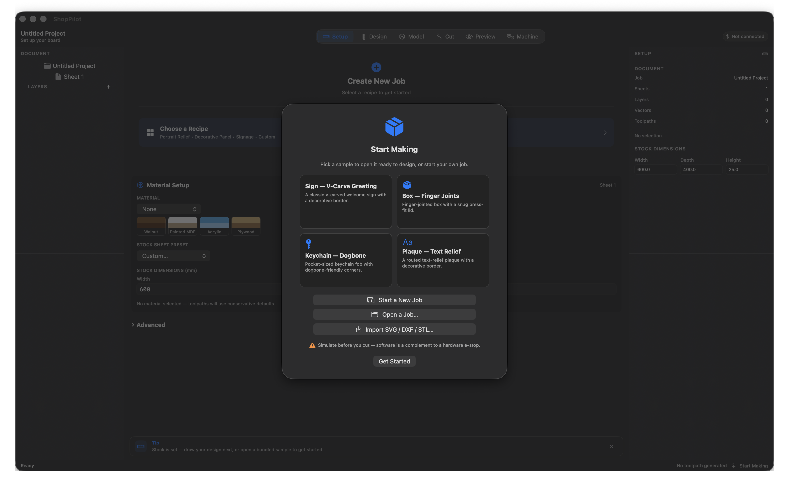
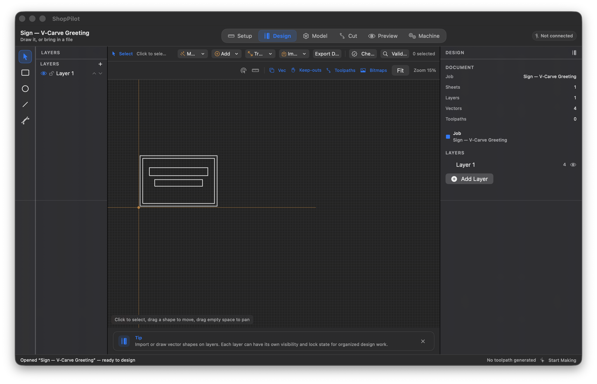
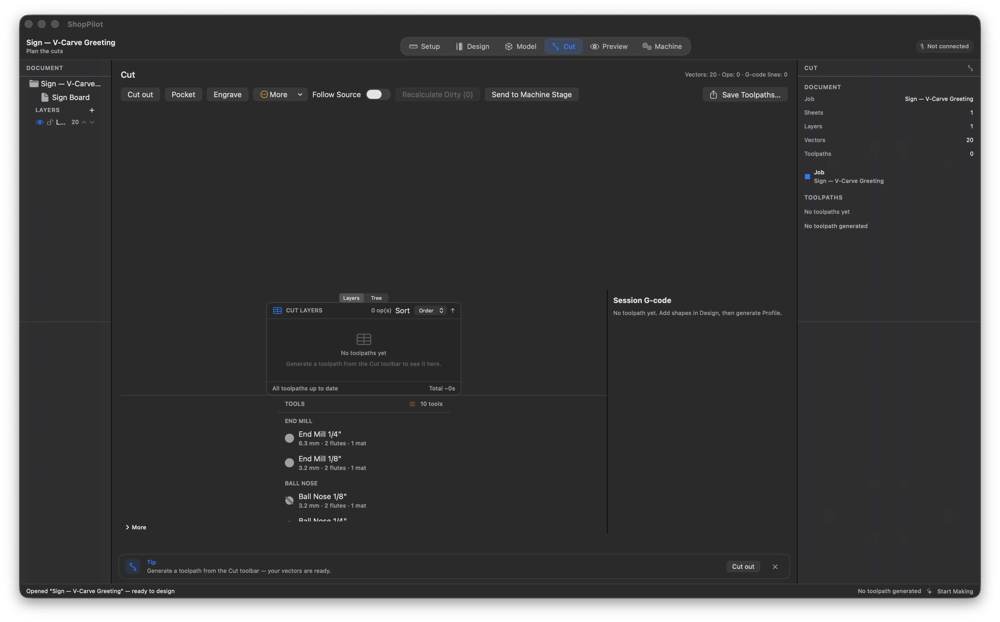
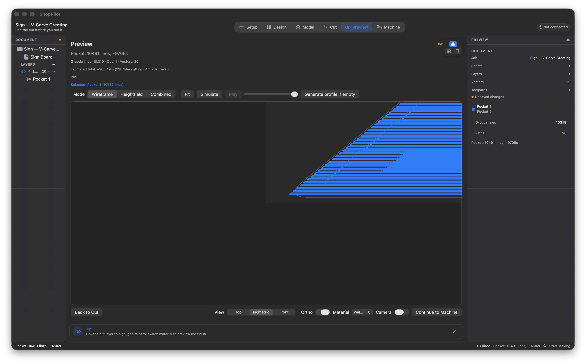
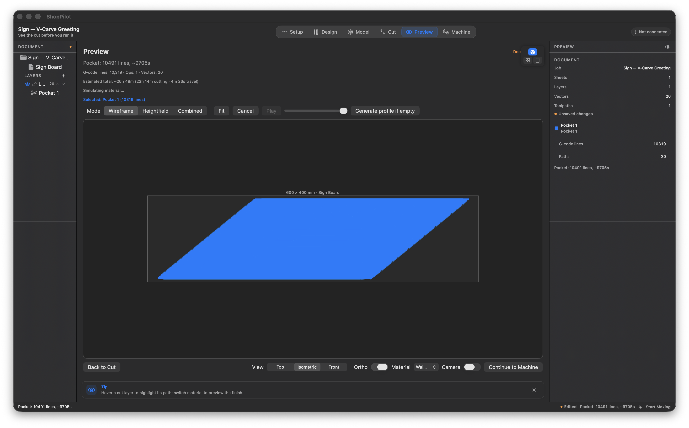
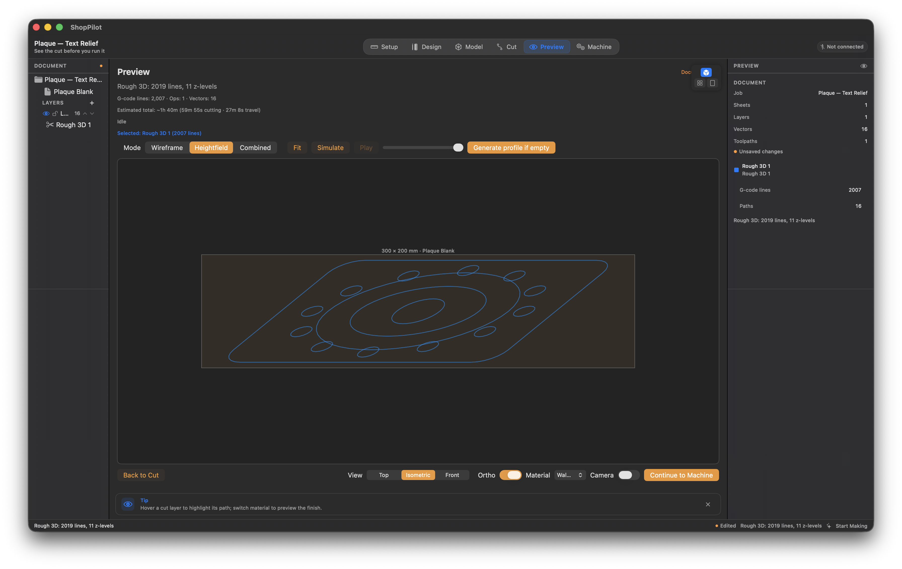
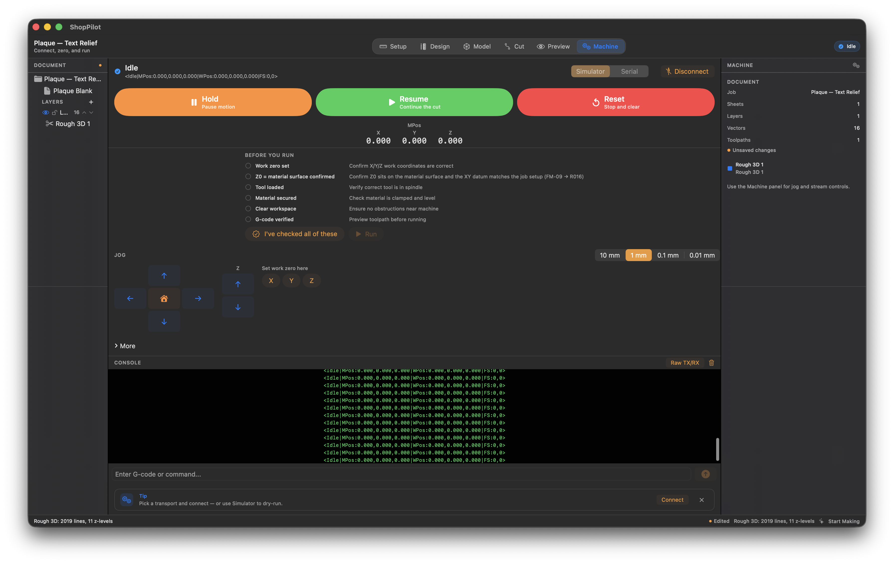

# ShopPilot

**Native macOS CNC suite** — design vector art, generate 2.5D toolpaths, simulate the cut, and run your machine. All on the Mac you already own.

> 🛑 **Safety first:** ShopPilot is a CAM + machine-control app, **not** a substitute for a hardware e-stop. The Preview heightfield and the built-in **simulator** are rehearsal tools — they do not prove a live cut is safe. Simulate, then air-cut, then cut. Keep a physical e-stop within reach.

[](https://developer.apple.com/macos)
[](https://swift.org)
[](#download)
[](LICENSE)

---

## Screenshots

Gallery: [`docs/screenshots/`](docs/screenshots/README.md). Shots below match the **0.06** UI. Preview is a SwiftUI **2.5D filled heightfield + playhead** — not Metal chip simulation, not Fusion GPU mill. Laser is **not** a product.

| Welcome | Design | Cut recipes |
| --- | --- | --- |
|  |  |  |

| Preview (pocket + stepover) | Preview (playhead) | Preview (3D relief) |
| --- | --- | --- |
|  |  |  |

| Machine (simulator) |
| --- |
|  |

Older numbered stills (`01-setup.png` … `06-preview.png`) remain in the same folder as aliases.

---

## Why ShopPilot?

- **Native, not a VM.** SwiftUI + CoreGraphics on Apple Silicon and Intel. No Parallels, no Boot Camp, no Windows license.
- **A 2.5D CAM suite — not LightBurn, not Fusion.** Vectors, booleans, layers, **Profile / Pocket / Drill / V-Carve**, and **3D rough/finish** from an STL or plaque heightfield. There is no laser/LightBurn product surface. Model orbit is a thin 2.5D relief view, not a 3D mill CAD viewport.
- **Welcome samples + stage rail + Cut recipes.** First launch: bundled sign, box, keychain, plaque. Six stages: **Setup → Design → Model → Cut → Preview → Machine**. Cut uses recipe buttons (Cut out / Pocket / Engrave + More).
- **First-hour CAM chrome.** Grid snap, marquee select, canvas XY DRO, sheet origin (corner/center), inspector **F / S / Z**, tabs/leads on the Design overlay, large **Machine DRO**, Model **Orbit**.
- **Machine control built in.** Jog, work zero, touch-off probe, feed override, G54–G59, spindle, serial to GRBL/FluidNC. **The bar is the simulator** (Hold / Resume / Reset always visible). Live serial exists; it is not the acceptance bar.
- **Safety by design.** Preflight before Run, no auto-run on load, dirty-toolpath export blocking. Software is not a hardware e-stop.

---

## Features

### Job & setup
- **Job setup** — single- or double-sided stock with sheet presets, custom material, mm/inch, document variables, driven dimensions.
- **Recipes** — Signage, Decorative Panel, Portrait Relief (pre-build design + toolpath tree).
- **Sample projects** — Welcome / Start Making: sign, box, keychain, plaque (re-open Welcome after first run).
- **Documents** — `.shoppilot` packages, 5-minute autosave + crash recovery, undo/redo.
- **Job sheets** — A4 HTML → PDF from Cut.

### Design (2D)
- **Create** — rectangle, circle, line, polyline, text (glyphs → curves, text on curve, 3D text relief).
- **Edit** — select/drag, **marquee**, multi-select, node editing, measure, dimension handles; **grid snap**; live **XY DRO**.
- **Origin** — sheet datum corner or center (job-level persist).
- **Operations** — Offset, Weld, Subtract, Intersect, Join, Close, Trim, Fillet, Extend, dogbone, vector boundary, Array/Circular copy, Keyhole, Nest.
- **Layers** — hide/lock, reorder; multi-sheet with duplication and toolpath transfer.
- **Import / export** — SVG, DXF, EPS, PDF, AI, DWG, WebP, bitmap trace, STL; design PDF export.

### Model & 3D (lean spine)
- STL → relief and bitmap → relief heightfields; 3D text; components / combine / mirror / sculpt strokes.
- **Rough 3D / Finish 3D / rest machining** from the heightfield.
- **Orbit** — thin 2.5D relief view (not Fusion-style 3D CAD).

### Toolpaths (CAM)
- **Profile** — in/out/on, climb/conventional, passes, **tabs**, ramping, **leads**, corner sharpen, ordering, allowance. Tabs/leads draw on the Design overlay.
- **Pocket** — offset/raster, multi-tool clearance, allowance, ramping.
- **Drill** — peck cycles, dwell, plunge feeds.
- **V-Carve** — depth shading, V-bit presets, flat-depth, clearance-tool, inlay recipes.
- **Inspector** — selected op **feed / spindle / Z** in the inspector shell.
- **Specialty (engine / later)** — extra strategies may appear in More. **Laser is held** — not a shipping product. Rotary wrap is not the lean north star.
- **Tool database** — classes, strategy defaults, manufacturer catalogs (Amana, Whiteside).
- **Tree & safety** — status dots, **async generate/recalc** (Cut out does not freeze the UI), keep-out zones, time estimates, templates, dirty-export blocking.

### Preview
- Full-tree **wireframe** plus sheet-aware **filled heightfield** (bit-radius stamp, cancellable). **Playhead / Play** over sim time. This is 2.5D raster, not chips, not Metal GPU mill.

### Machine control
- **Transports** — **simulator first**; real serial (GRBL/FluidNC) with port/baud pickers.
- **Operation** — jog, home, work zero, G38.2 touch-off, feed override, spindle, G54–G59, stream G-code, Hold / Resume / Reset, raw TX/RX console, large **Machine DRO**.
- **Safety** — preflight gates Start; zero bytes on load (no auto-run); disconnect stops the stream; Hold / Reset always visible while connected.

### Platform & UX
- **Stage rail** — Setup → Design → Model → Cut → Preview → Machine, ≤12 icons per stage.
- **⌘K**, context menus, coach strip, editable shortcuts, GRBL-oriented post templates.

> Scope: **personal use only, never for sale.** No 3D-view vector editing, no Fusion parametric modeling, no LightBurn/laser product.

---

## Download

Grab the prebuilt app — no build required:

1. Download [`dist/ShopPilot-0.06-macOS.zip`](dist/ShopPilot-0.06-macOS.zip) (universal: Apple Silicon + Intel, ad-hoc signed) — or build with `scripts/package_app.sh`.
2. Unzip and drag **ShopPilot.app** into Applications.
3. First launch from another Mac: **right-click → Open** (Gatekeeper), or:
   ```bash
   xattr -dr com.apple.quarantine /Applications/ShopPilot.app
   ```

*The zip is rebuilt from source with [`scripts/package_app.sh`](scripts/package_app.sh) — the unpacked `.app` is not committed. `CFBundleShortVersionString` is the `VERSION` you pass to that script.*

---

## Build from source

Requires **Xcode 15+** (macOS 14+ SDK).

```bash
export DEVELOPER_DIR=/Applications/Xcode.app/Contents/Developer

# Prefer the lock when other terminals may compile
./scripts/swift_locked.sh build --product ShopPilot
./scripts/swift_locked.sh run ShopPilot

# Single CLT (repo test gate — CLT has no XCTest)
./scripts/verify_locked.sh ShopPilotVerify1201
```

Release zip (match the committed 0.06 artifact):

```bash
VERSION=0.06 ZIP_NAME=ShopPilot-0.06-macOS.zip ./scripts/package_app.sh
# → dist/ShopPilot-0.06-macOS.zip (universal arm64 + x86_64, ad-hoc signed)
```

Do not run bare `swift build` / `swift test` as the default gate.

---

## First 15 minutes

1. **Welcome / Setup** — Try a sample (sign, box, keychain, plaque) or a recipe, or set stock + material.
2. **Design** — Rect / Circle / Line / Polyline, text, or import SVG / DXF / STL. Toggle **snap**; marquee-select; watch the **XY DRO**; set **sheet origin**.
3. **Cut** — Cut out / Pocket / Engrave (or More). Inspector shows **F / S / Z**. Recalc is async. Export stays blocked while dirty.
4. **Preview** — Simulate; use the **playhead**. Filled heightfield, not a chip renderer.
5. **Model** (optional) — relief + Rough/Finish 3D; **Orbit** for a 2.5D look-around.
6. **Machine** — **Simulator** → Connect → preflight → Run. Hold / Reset stay visible. Serial is optional after that.

Full walkthrough: [`docs/planning/TUTORIAL_FIRST_CUT.md`](docs/planning/TUTORIAL_FIRST_CUT.md)

---

## Where to work

| Doc | Role |
| --- | --- |
| [`docs/planning/TUTORIAL_FIRST_CUT.md`](docs/planning/TUTORIAL_FIRST_CUT.md) | End-user first-cut tutorial |
| [`docs/planning/SAFETY.md`](docs/planning/SAFETY.md) | Safety policy |
| [`MASTER_KANBAN.md`](MASTER_KANBAN.md) | **Only task board** |
| [`docs/planning/CHANGELOG.md`](docs/planning/CHANGELOG.md) | Release history (0.01 → 0.06) |
| [`docs/planning/PACKAGING.md`](docs/planning/PACKAGING.md) | How to zip the `.app` (personal use) |
| [`docs/screenshots/README.md`](docs/screenshots/README.md) | Screenshot pack |

---

## Status (honest)

**Current package:** personal-use **0.06** ([`dist/ShopPilot-0.06-macOS.zip`](dist/ShopPilot-0.06-macOS.zip)), HEAD `4683a9f` or later. Lean bar: router CAM — design → toolpaths → 2.5D preview → **simulator** (serial exists).

**Shipped on this tip:** Welcome samples, stage rail, Cut recipes, SPK-1800 first-hour chrome, SPK-1700 Preview playback, SPK-UI-BUG-03 async Cut generate. Live AX `ui_drive_full` 14-stage walk has **PASS**ed twice (Hermes). **Laser / LightBurn held.**

**Still owner-gated:** **SPK-0623** personal-use UI acceptance — `[ ]` until the owner marks it. Agents must not rubber-stamp. Optional live air-cut **SPK-0419** stays `[!]`. No App Store / notarization.

```bash
export DEVELOPER_DIR=/Applications/Xcode.app/Contents/Developer
./scripts/run_overnight_shakedown.sh   # → results/CLTS.md
```

Finish definition = **Engine + UI + Persist + Verify** per card.

## Stack

SwiftUI · macOS 14+ · `ShopPilot` (app) · `ShopPilotCore` (engine) · `ShopPilotSerial` (transport) · `ShopPilotGeometry` (geometry) · `ShopPilotVerify*` CLT targets

## License

Proprietary — see `LICENSE`. **Personal use only; never for sale.** All code and documentation written from scratch; no third-party proprietary assets.
