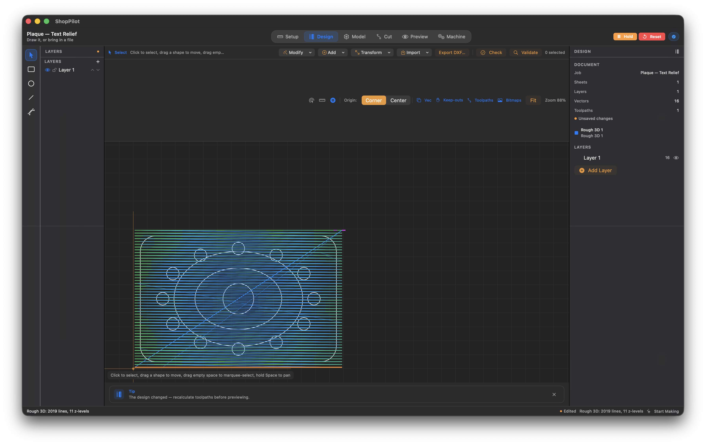
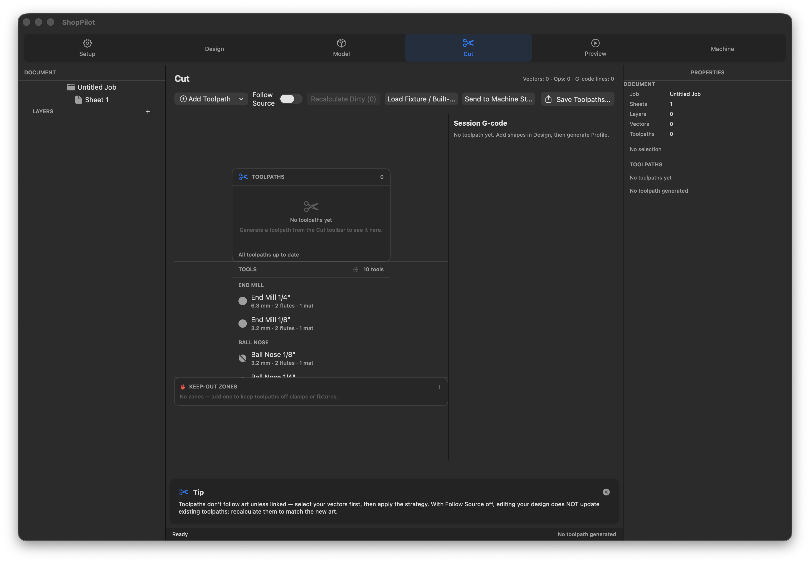
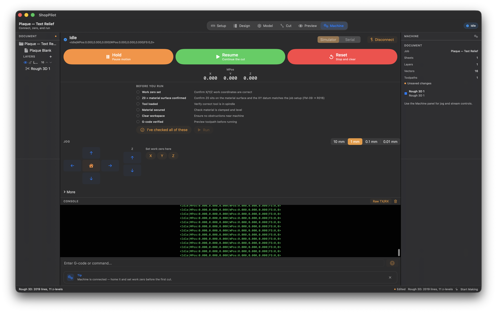
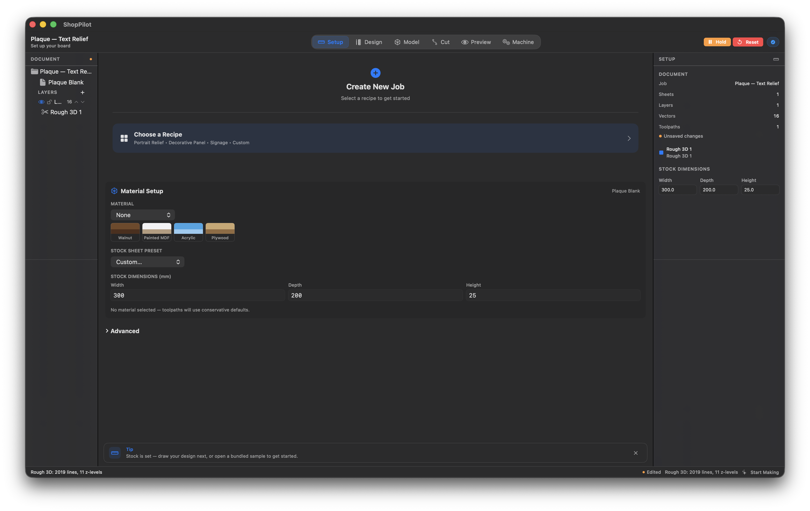
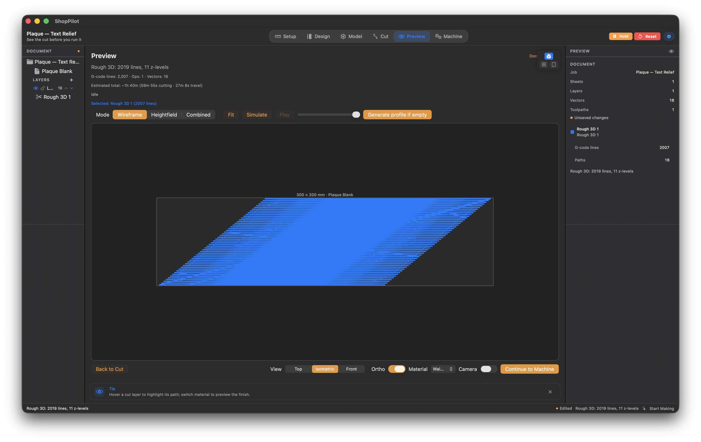
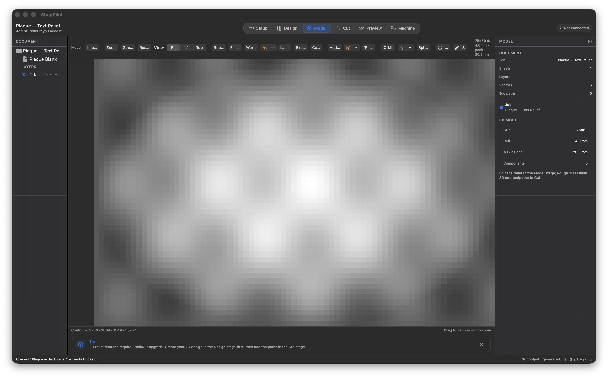

# ShopPilot — Mac-Native CNC Studio

**Native macOS · Apple Silicon + Intel · No Windows VM required**

---

## What is ShopPilot?

ShopPilot is a professional-grade Computer-Aided Manufacturing (CAM) application built natively for macOS. It generates CNC toolpaths from 2D vector designs and 3D relief models, then streams G-code to your machine — all without the bloat, Windows-only limitations, or subscription pricing of legacy alternatives.

**Scope:** personal use only, never for sale. No 3D-view vector editing, no Fusion-style parametric modeling — a focused 2.5D CAM tool with relief editing on the Model stage.

## Screenshots

| Design & layers | Toolpaths & dirty gating | Machine control & safety |
| --- | --- | --- |
|  |  |  |

| Setup & recipes | Preview & simulation | Model & 3D |
| --- | --- | --- |
|  |  |  |

---

## Why ShopPilot?

### Native Mac, Not a VM
ShopPilot runs natively on Apple Silicon (M1/M2/M3/M4) and Intel Macs. No Parallels, no Boot Camp, no Windows license needed. The app leverages SwiftUI for the UI and CoreGraphics for rendering — technologies built specifically for macOS.

### Personal Use, No Subscription
Built for a single owner's workshop. No subscription, no account, no cloud dependency, no telemetry — fully offline.

### Integrated Machine Control
Connect your CNC machine directly from ShopPilot — jog axes, set work zero, touch-off probe, override feed, switch work offsets (G54–G59), stream G-code, and monitor status in real time. The built-in simulator lets you test everything before touching hardware.

### Smart Safety
- **Preflight checklist** — ack each item (work zero, Z0, tool loaded, material secured, workspace clear, G-code verified) before Run unlocks.
- **Dirty flag system** — prevents exporting stale toolpaths after design changes.
- **Always-visible Hold / Resume / Reset** during machine operation.
- **Simulator-first workflow** — rehearse every job in software, then cut.

---

## Key Features

| Category | Features |
|----------|----------|
| **Design** | Draw/edit vectors, import SVG/DXF/EPS/PDF/AI/DWG/WebP/STL, offset, boolean ops (weld/subtract/intersect), join/close/trim/fillet, dogbone corner relief, vector boundary, nest, layers, undo/redo, smart selection + dimension handles |
| **Model** | STL/bitmap → relief heightfield, 3D text relief, components, mirror modes, sculpt strokes |
| **Toolpaths** | Profile, Pocket, Drill, V-Carve (+ clearance), inlay recipes, 3D rough/finish/rest, thread milling, rotary wrap, laser, drag knife, photo V-Carve, texture, fluting, prism, chamfer, sketch carve, quick engrave — with dirty-gating and async recalc |
| **Machine** | Serial (port/baud pickers) + simulator, jog/zero, touch-off probing, feed override, spindle control, work offsets, G-code streaming, Hold/Reset safety controls |
| **Preview** | Heightfield + wireframe + combined simulation, sheet-aware stock, material surfaces, peck-drill viz, cancellable draft sim |
| **Tools** | 13 tool classes, 17 strategy defaults, manufacturer catalogs (Amana/Whiteside), toolpath templates, accel-aware time estimates |
| **Export** | GRBL-compatible G-code, design PDF export, job sheets (HTML→PDF), Post Studio templates, `.shoppilot` job packages |
| **UX** | Custom app icon + brand accent, stage rail (≤12 icons), ⌘K command palette, context menus, coach strip, editable shortcuts, material swatches, sample projects, autosave + crash recovery |

---

## Getting Started

1. Open ShopPilot and pick a **recipe** (Signage, Decorative Panel, Portrait Relief) or a bundled **sample project** — or set up your own stock.
2. **Design** — draw or import your artwork, then add text or relief.
3. **Cut** — add toolpaths; the tree shows each op's status and recalculates asynchronously when the design changes.
4. **Preview** — simulate the cut on your sheet's actual material.
5. **Machine** — rehearse on the Simulator, then switch to Serial and run for real.

Full walkthrough: [`TUTORIAL_FIRST_CUT.md`](TUTORIAL_FIRST_CUT.md)

---

## Safety First

- Always simulate before cutting.
- Keep a hand on the **Hold** button (or a physical e-stop) when running.
- ShopPilot never auto-runs G-code on load, and blocks export of stale toolpaths.

---

## Documentation

| Doc | Role |
| --- | --- |
| [`../README.md`](../../README.md) | Root README (current) |
| [`TUTORIAL_FIRST_CUT.md`](TUTORIAL_FIRST_CUT.md) | End-user first-cut tutorial |
| [`SAFETY.md`](SAFETY.md) | Safety guidelines |
| [`CHANGELOG.md`](CHANGELOG.md) | Release history |
| [`../../MASTER_KANBAN.md`](../../MASTER_KANBAN.md) | Task board |

---

## License

Proprietary — see `LICENSE`. **Personal use only; never for sale.**
